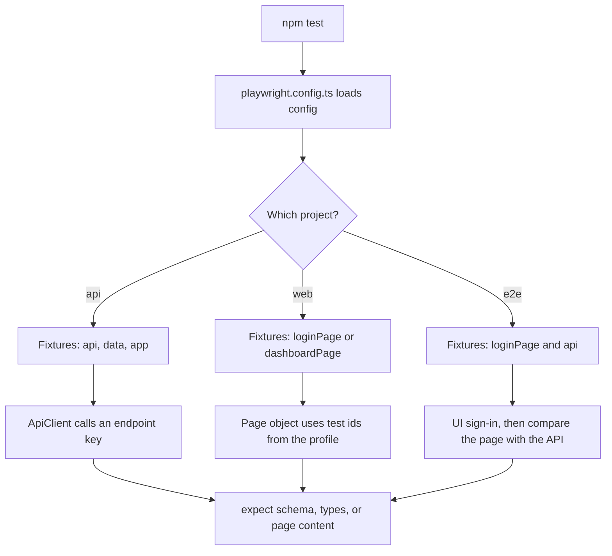

# How this framework runs, for beginners

This guide follows one command, `npm test`, from start to finish. You do not need to know Playwright already. Read it once, then open the files it names.

## The idea

A test should say **what to check**. The framework already knows **where the app lives**, **which user to sign in as**, and **how to talk to the API or the page**.

Those facts sit in JSON files. The test asks for them by name.

```text
npm test
  → read config (which app, which URLs)
  → pick API tests, browser tests, or end-to-end tests
  → hand each test ready-made tools (fixtures)
  → the test calls the API or the page
  → the test checks the answer
```

## Words used below

| Word | Plain meaning |
| --- | --- |
| Spec | A file of tests. Names end in `.spec.ts`. |
| Fixture | A tool Playwright builds for you before the test runs, such as `api` or `loginPage`. You list the ones you need in the test arguments. |
| Config | JSON that names URLs, endpoints, and buttons. |
| Dataset | JSON that holds users, sensors, and chart numbers. |
| Page object | A class that knows how to use one screen, such as `LoginPage`. |
| Component | A reusable piece of a screen, such as a table or a chart. |
| Schema | A contract that says which fields a response must have, and what type each field is. |
| Project | A Playwright group. This repo has an API project, a web project per browser, and an end-to-end project. |

## Step by step

### 1. You start the suite

```powershell
npm test
```

That runs Playwright. Playwright loads `playwright.config.ts` before any test.

### 2. Config decides the target

`playwright.config.ts` calls `loadConfig()` in `src/core/config/config.loader.ts`.

The loader reads `config/manifest.json`:

- `defaultEnv` is `local` unless you set `ENV`
- `defaultApp` is `indore` unless you set `APP_ID`

It then opens two JSON files:

- `config/environments/local.json` — site URL, API URL, and timeouts
- `config/apps/indore.json` — pages, Indore API paths, button ids, browsers, and where schemas live

`local` points at `http://localhost:5173` (UI) and `http://localhost:3000` (API). Those processes must already be running. `qa` points at the live hosts.

A string like `{{env.PASSWORD}}` in a dataset means: use the environment variable when it is set.

### 3. Playwright splits the work into projects

The app profile lists browsers. The config builds one project per browser.

| Project | Which files | Browser |
| --- | --- | --- |
| `api` | `tests/api/**/*.spec.ts` | none |
| `web-chromium`, `web-firefox`, `web-webkit` | `tests/web/**/*.spec.ts` | one browser each |
| `e2e-chromium` | `tests/e2e/**/*.spec.ts` | Chromium |

API tests never open a browser. Web tests open every browser listed in the profile. End-to-end tests open Chromium only, so the long user journey stays fast.

Tests in one project run in parallel.

### 4. Each test receives fixtures

Every spec imports `test` from `src/core/fixtures/test.fixtures.ts`, not from Playwright directly. That file adds the tools below.

| Fixture | What you get |
| --- | --- |
| `app` | The Indore profile: routes, endpoints, test ids |
| `env` | URLs and timeouts |
| `data` | Readers for `data/**/*.json` |
| `api` | A client that calls endpoints by key, such as `'login'` or `'dtrs'` |
| `schema` | The JSON Schema checker |
| `loginPage` | The sign-in page object |
| `dashboardPage` | The dashboard page object, already signed in |

`dashboardPage` signs in through the API, then stores the token under the key named in the profile (`authToken`). The browser is signed in before your test opens the dashboard. Use `loginPage` when the test itself must click Sign in.

### 5. The test runs and checks a result

Three checks show up often:

- `expect(value).toMatchJsonSchema('health')` compares the body with `config/apps/indore/schemas/health.schema.json`
- `expect(value).toMatchDataTypes(...)` checks types listed in a JSON file, such as “this field is a number”
- Zod schemas in `src/core/api/models.ts` turn the JSON into typed TypeScript before the test uses fields like `body.data.accessToken`

A failure saves a screenshot. A retry saves a trace. Open the report with `npm run report`.

## Follow one API test

File: `tests/api/auth/login.api.spec.ts`

```ts
test('returns a typed access token @smoke', async ({ api, data }) => {
  const result = await api.authenticate(data.user('validAdmin'));
  expect(result.status).toBe(200);
  expect(result.body.data.user.email).toBe(data.user('validAdmin').email);
});
```

What happens:

1. The test asks for `api` and `data`. Playwright builds those fixtures.
2. `api.authenticate` posts to the `login` endpoint in `config/apps/indore.json`.
3. The client joins it to the API base URL, so the call is `POST http://localhost:3000/indore/auth/login`.
4. Zod checks that the body has `success: true` and an access token.
5. The test expects the returned email to match `data/auth/users.json`.

No browser opens.

The folder `tests/api/auth/` is the **Authentication** functionality. The title tags `@auth`, `@regression`, and `@smoke` let you run a slice:

```powershell
npm run test:smoke
npx playwright test --grep @auth
```

## Follow one web test

File: `tests/web/auth/login.web.spec.ts`

```ts
test('admin can open the operations dashboard @smoke', async ({ loginPage, data, page, app }) => {
  await loginPage.open();
  await loginPage.signIn(data.user('validAdmin'));
  await expect(page).toHaveURL(new RegExp(`${escapeRegExp(app.routes.dashboard)}$`));
  await expect((await new DashboardPage(page, app).dtrTable()).root).toBeVisible();
});
```

What happens:

1. `data.user('validAdmin')` reads `data/auth/users.json` and returns the Indore operator email.
2. `loginPage.open()` goes to the route named `login` in the profile, which is `/login`.
3. `signIn` types into the Email and Password fields. The page object finds them with `findByLabelText` from `app.ui.elements`. Other controls use `findByRole`, `findByText`, or `findByTestId`.
4. The page posts to the login endpoint from the app profile, stores the access token, and moves to `/dashboard`.
5. The test checks the URL and that the DTR table is on screen.

Playwright runs this file three times: Chromium, Firefox, and WebKit.

`LoginPage` lives in `src/pages/login.page.ts`. `signIn` fills the email and password fields from the app profile, then submits the form.

## Follow one end-to-end test

File: `tests/e2e/monitoring/communication.e2e.spec.ts`

This is a full user journey:

1. The API signs in and downloads Indore DTRs and the communication series.
2. The browser signs in through the form, the same way a person would.
3. The dashboard table must show the same DTR the API returned.
4. The communication chart must show the same series the API returned.

`ChartComponent` (`src/core/components/chart.component.ts`) reads the chart in this order: Chart.js, then Highcharts, then SVG. The live dashboard can use any of those without a new test style.

Chart cases for the web suite live in `data/dashboard/charts.json`. Adding a metric there, plus an element query in the app profile, covers another chart with the existing spec.

## Where to look when you change something

| You want to… | Open |
| --- | --- |
| Change the site URL | `config/environments/local.json` or set `BASE_URL` |
| Add an API path | `endpoints` in `config/apps/indore.json` |
| Change how a control is found | `ui.elements` in the same profile (`findByRole`, `findByLabelText`, `findByText`, or `findByTestId`) |
| Change a password or DTR | `data/auth/users.json` or `data/assets/dtrs.json` |
| Reject a bad login in a test | `data/auth/invalid-logins.json` |
| Describe a legal API body | `config/apps/indore/schemas/*.schema.json` and the matching Zod schema in `src/core/api/models.ts` |
| Add a screen | a new class next to `src/pages/login.page.ts` |
| Add a test | `tests/api/<function>/`, `tests/web/<function>/`, or `tests/e2e/<function>/` |

A new spec should import `test` and `expect` from `src/core/fixtures/test.fixtures.ts`, sit in a functionality folder, and put a tag such as `@sensors` in the `test.describe` title.

## A picture of one test



## Run a smaller slice while you learn

```powershell
npm run test:api
npm run test:web
npm run test:e2e
npm run test:smoke
npx playwright test tests/api/auth/login.api.spec.ts
```

Start with the login API spec. It is the shortest path through config, the API client, and a schema check.
